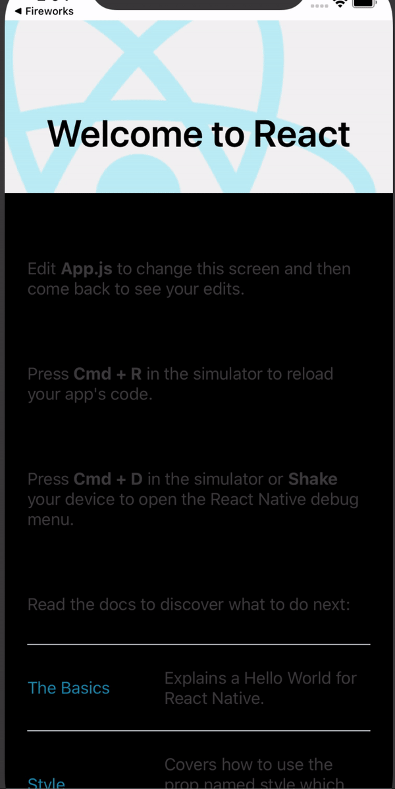

# Fireworks

A customizable firework like animation that can be used as a component in a react native project.



# Installation

```javascript
npm i react-native-fireworks
```

# Import


```javascript
import Fireworks from 'react-native-fireworks'
```

# Usage

Minimal code to ignite the fireworks 🎇

```javascript
<Fireworks/>
```

The parameters like the speed of the explosions, the density of fireworks and the colors of the fire can be customized.

```javascript
<Fireworks
  speed={3}
  density={8}
  colors={['#ff0','#ff3','#cc0','#ff4500','#ff6347']}
  iterations={5}
  height={150}
  width={100}
  zIndex={2}
  circular={true}
/>
```

# Props
There are 8 props and all the 8 are <b>optional.</b><br/><br/>
### 1.  speed
It denotes how fast will an individual cracker explode.
It is a number with possible values- 1,2 and 3. 1 is for the slowest and 3 for the fastest. The default value is 2.

### 2.  density
It denotes the number of crackers exploding simultaneously.
It is a number between 1 and 10. The default value is 5.

### 3.  colors
The fireworks explode into colorful light crystals. You can set the colors of your choice by passing their hex codes or rgb values (as Strings) in an array.
If you don't pass any colors, luckily you will get light crystals of all possible colors ranging from <b><i>'rgb(0,0,0)'</i></b> to  <b><i>'rgb(255,255,255)'</i></b>.

### 4.  iterations
It denotes the number of times the explosions take place. The <i>density</i> prop controls the number of simultaneous explosions whereas <i>iterations</i> tells how many times the simultaneous explosions should occur.<br/><br/>It can be any number or the string- 'infinite'. The default value is <b>'infinite'</b>.

### 5.  height
Height of the area in which fireworks are rendered. Its default value is the height of the screen.


### 6.  width
Width of the area in which fireworks are rendered. Its default value is the width of the screen.

### 7.  zIndex
zIndex of the Firework component. Its default value is 10.

### 8. circular
When set to true, the crackers burst making a circle as shown below. The default value is false.<br/><br/>


